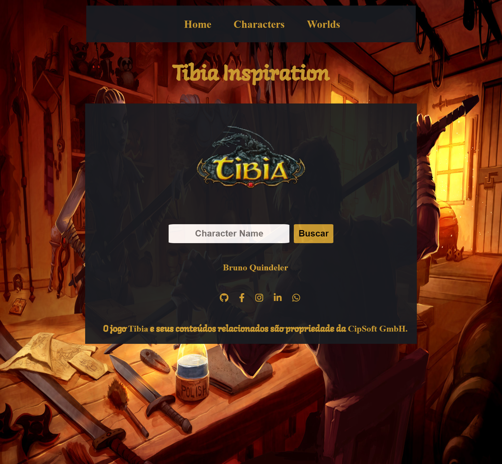

  :octocat: :octocat: :octocat:

# Tibia Inspiration

O **Tibia Inspiration** é um projeto que foi realizado para praticar [**HTML**](https://developer.mozilla.org/pt-BR/docs/Web/HTML), [**CSS**](https://developer.mozilla.org/pt-BR/docs/Web/CSS) e [**JS**](https://developer.mozilla.org/pt-BR/docs/Web/JavaScript).

Neste projeto é consumido a [**API**](http://https://www.redhat.com/pt-br/topics/api/what-are-application-programming-interfaces) do [**MMORPG Tibia**](http://tibia.com) e todo conteúdo é manipulado e mostrado para o usuário.

## Conceitos aprendidos

* **Manipulação da DOM**
* **Fetch**
* **Callbacks**
* **Responsividade**
<h2 align="center">Imagem ilustrativa</h2>

  

  :octocat: :octocat: :octocat:

